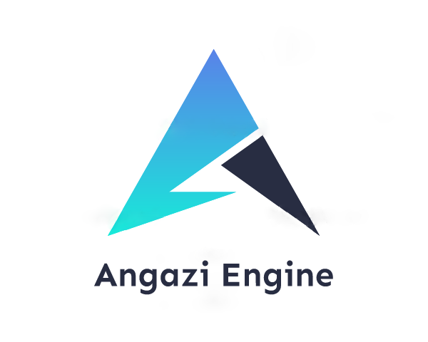

# Angazi
<!-- PROJECT LOGO -->
<br />
<p align="center">
  <a href="https://github.com/Jct8/Angazi">
    
  </a>
</p>

<!-- TABLE OF CONTENTS -->
## Table of Contents
* [About the Project](#about-the-project)
* [Getting Started](#getting-started)
  * [Prerequisites](#prerequisites)
  * [Usage](#usage)
* [Engine Features](#engine-features)
  * [Graphics](#graphics)
  * [Memory Management](#memory-management)
  * [Meta Reflection System](#meta-reflection-system)
  * [Component System](#component-system)
  * [Networking](#networking)
  * [Artificial Intelligence](#artificial-intelligence)
  * [Math and Physics](#math-and-physics)
  * [Level Editor](#editor)
* [Contact](#contact)
* [External Libraries](#external-libraries)
* [Acknowledgements](#acknowledgements)

<!-- ABOUT THE PROJECT -->
## About The Project

<!-- [![Product Name Screen Shot][product-screenshot]](https://example.com)-->

Angazi is a custom-designed engine using C++ 17, DirectX11, and OpenGL.
The engine is designed and structured into a Framework and Engine layer, 
providing an easier interface for creating projects.

The Graphics library supports both DirectX11 and OpenGL. The design of this library is based on the DirectX11 pipeline,
with the OpenGL library designed to follow the same format. The Engine supports both HLSL and GLSL shaders.

<!-- GETTING STARTED -->
## Getting Started

### Prerequisites

Visual Studio 2019

### Usage

The Engine requires one header include, reference to the Angazi Project and reference to the Angazi Property sheet.

```sh
    #include <Angazi/Inc/Angazi.h>
```

Switching between DirectX11 and OpenGL requires one of the following defines in Core's common.h:
```sh
    #define ENABLE_DIRECTX11
    #define ENABLE_OPENGL
```

1. Running an existing project
   1. Set the project as the startup project and run
1. Creating a new project
   1. Add a new empty windows desktop application project
   2. Add a reference to the Angazi Project
   3. Add the Angazi.props property sheet to the project in the property manager
   4. Create a WinMain file with a corresponding State file
   5. Include the Angazi.h header file
3. Accessing Library functions
   1. Libraries can be accessed from the Angazi namespace and the relative library name. E.g. Angazi::Graphics

## Engine Features

### Graphics
This engine supports rendering in both DirectX11 or OpenGL.
Rendering features include:
1. Loading skinned models
2. Playing skeletal animations with animation blending
3. 2D Sprite rendering
4. Drawing debug lines
5. Standard shader techniques:
    1. Blinn-Phong Lighting
    2. Normal Mapping
    3. Bump Mapping
    4. Ambient Occlusion
    5. Specular Mapping
    6. Shadow Mapping
6. PBR shader techniques
    1. Cook-Torrance BRDF
    2. Image-based lighting - Currently only diffuse lighting
7. Other shader techniques:
    1. Deferred HDR pipeline
    2. Gamma Correction
    3. Cube and Environment Mapping
    4. Water effect
    5. Post Processing

### Memory Management
1. Block Allocator - Pre-allocated memory that serves to avoid memory fragmentation
2. Typed Allocator - Allows the user to specify the type of memory used in the block allocator
3. Handle Pool - Handles the validity of pointers to objects 

### Meta Reflection System
1.  The meta system allows for run-time inspection of classes and fields declared in the system
2.  Meta information can be looked up from a string name in the centralized meta registry
3.  The engine uses the system for generic serialization and deserialization of scene, gameobject and component data
3.  The system supports the following:
    1. Meta Classes
    2. Meta Fields
    3. Meta Pointers
    4. Meta Arrays
    5. Meta Types

### Component System
1. The engine supports a components based system for game objects
2. The scene, game objects and components can be serialized and deserialized using the meta system

### Networking
1. TCP and UDP sockets classes that allow for easier use, creation, and deletion of sockets
2. Packets can be serialized and deserialized using the Memory Stream, Stream Reader and Writer
3. Uses a network system helper class that refers object instances across a network to their network ids

### Artificial Intelligence 
1. Finite State Machine
2. Goal-driven behaviour
3. Pathfinding using AStar, Djikstras, BFS, and DFS 
4. Agent Perception
5. Steering Behaviour

### Math and Physics
1. Linear Algebra operations for:
    1. Vector3 and Vector4
    2. Matrix3 and Matrix4
    3. Quaternions
2. Particle system simulations using Verlet Integration

### Level Editor
1. The Angazi Editor allows for adding and removing game objects in the scene
2. Components that are registered in the meta system can be added, removed or modified
3. The Editor can save and load scenes


<!-- CONTACT -->
## Contact

Justin - tim.justin8@gmail.com

<!--Project Link: [https://github.com/Jct8/Angazi](https://github.com/Jct8/Angazi) -->

[![LinkedIn][linkedin-shield]][linkedin-url]

## External Libraries
* [Assimp](https://www.assimp.org/)
* [DirectXTK](https://github.com/microsoft/DirectXTK)
* [DirectXTex](https://github.com/microsoft/DirectXTex)
* [FW1FontWrapper](https://github.com/gamelaster/FW1FontWrapper)
* [GLEW](http://glew.sourceforge.net/)
* [Imgui](https://github.com/ocornut/imgui)
* [RapidJson](https://github.com/Tencent/rapidjson/)

## Acknowledgements
* Peter Chan

<!-- MARKDOWN LINKS & IMAGES -->
<!-- https://www.markdownguide.org/basic-syntax/#reference-style-links -->
[linkedin-shield]: https://img.shields.io/badge/-LinkedIn-black.svg?style=flat-square&logo=linkedin&colorB=555
[linkedin-url]: https://www.linkedin.com/in/justintim0/
[product-screenshot]: images/screenshot.png
